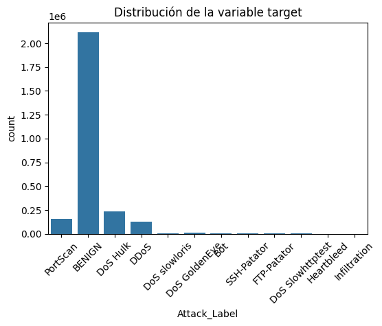

# SISTEMA DE DETECCIÓN DE ATAQUES DDOS BASADO EN DEEP LEARNING EN ENTORNOS DE RED

Este repositorio contiene el código y los recursos para el preprocesamiento de datos del proyecto de tesis enfocado en la detección de ataques de denegación de servicio distribuido (DDoS) utilizando técnicas de Deep Learning.

## Autores / Equipo

* **Autor(es):** `FLORES QUILICHE, Fernando`, `RODRIGUEZ MALMA, Josef Renato`
* **Correo:** `fernando.flores.q@uni.pe - josef.rodriguez.m@uni.pe`

## Dataset

El conjunto de datos de este proyecto es una captura de tráfico de red proporcionada por una importante empresa de telecomunicaciones en Perú. Por motivos de confidencialidad, la identidad de la empresa se mantiene anónima.

La recolección de datos se realizó durante la segunda semana de mayo de 2025, centrándose exclusivamente en el horario nocturno, desde las 10:00 p.m. hasta las 6:00 a.m. Este periodo fue seleccionado por ser una ventana crítica donde, a pesar del menor volumen de tráfico legítimo, los sistemas de monitoreo y respuesta suelen ser más vulnerables.

* **Descripción:**

  * El dataset capturado contiene un total de 2,670,479 flujos de red y 20 características por flujo.
  * Las variables incluyen métricas clave de la comunicación en red, como la duración del flujo (Flow Duration), el conteo total de paquetes (Total Fwd Packets) y la etiqueta de clasificación (Attack_Label), que distingue el tráfico anómalo del normal.
  * Para los fines de este estudio, la variable Attack_Label ha sido binarizada, asignando el valor 0 al tráfico BENIGN (benigno) y 1 a cualquier tipo de ATTACK (ataque).

* **Versión utilizada:**

  * **Periodo de captura:** Segunda semana de mayo de 2025 (del 05/05/2025 al 11/05/2025).

## Requisitos

Para ejecutar el notebook de preprocesamiento, es necesario contar con las siguientes librerías de Python. Puede instalarlas utilizando `pip`:

```bash
pip install -r requirements.txt
```
El contenido del archivo requirements.txt es el siguiente:
```bash
pandas
numpy
matplotlib
seaborn
scikit-learn
imblearn
```

## Estructura del Repositorio
El proyecto se organiza de la siguiente manera para mantener la claridad y facilitar la reproducibilidad:

```bash
├── data/
│   ├── raw/
│   │   └── dataset_ddos.csv        # Dataset original sin procesar
│   └── processed/
│       └── ddos_balanceado.csv     # Dataset balanceado y listo para el modelo
│
├── notebooks/
│   └── DDos_attack.ipynb  # Notebook con el análisis y balanceo
│
├── src/
│   └── ...                         # Scripts de Python para funciones auxiliares (si aplica)
│
├── README.md                       # Este archivo
└── requirements.txt                # Dependencias del proyecto
```

## Cómo correr el pipeline
El notebook DDos_attack.ipynb realiza el primer paso fundamental del proyecto. Para reproducir el experimento de preprocesamiento, siga estos pasos:

1. Clonar el repositorio:

```bash
git clone [URL-del-repositorio]
cd [nombre-del-repositorio]
```

2. Instalar dependencias:
```bash
pip install -r requirements.txt
```
3. Ubicar el dataset: Coloque el archivo dataset_ddos.csv en la carpeta data/raw/.

4. Ejecutar el notebook: Abra y ejecute todas las celdas del notebook notebooks/DDos_attack.ipynb en un entorno como Jupyter Lab o Google Colab.

## Resultados Esperados
Al ejecutar completamente el notebook de preprocesamiento, el pipeline generará el siguiente resultado:
- Un archivo llamado ddos_balanceado.csv en la carpeta data/processed/.
- Este archivo contendrá un subconjunto de los datos originales, con las clases benigna y ataque perfectamente balanceadas (50%-50%) mediante la técnica de submuestreo (Undersampling). El dataset resultante tiene 1,116,322 registros.

## EDA + accionables
### Reporte de Clasificación (Conjunto de Prueba)

|               | precision | recall | f1-score | support |
| :------------ | :-------- | :----- | :------- | :------ |
| **BENIGN** | 0.9990    | 0.9895 | 0.9942   | 315737  |
| **ATTACK** | 0.9617    | 0.9962 | 0.9786   | 83320   |
|               |           |        |          |         |
| **accuracy** |           |        | 0.9909   | 399057  |
| **macro avg** | 0.9803    | 0.9929 | 0.9864   | 399057  |
| **weighted avg**| 0.9912    | 0.9909 | 0.9910   | 399057  |

### Matriz de Confusión (Conjunto de Prueba)

```
[[312428   3309]
 [   315  83005]]
```

### Otras Métricas

```
ROC-AUC: 0.99959 | PR-AUC: 0.99841
```
### Distribuciones y relaciones
1. Distribución de la variable target


Riesgos: desbalance, leakage, drift, sesgos.
Conclusiones accionables (minimo 2)